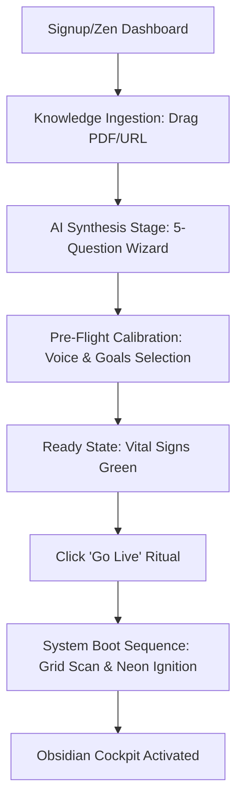
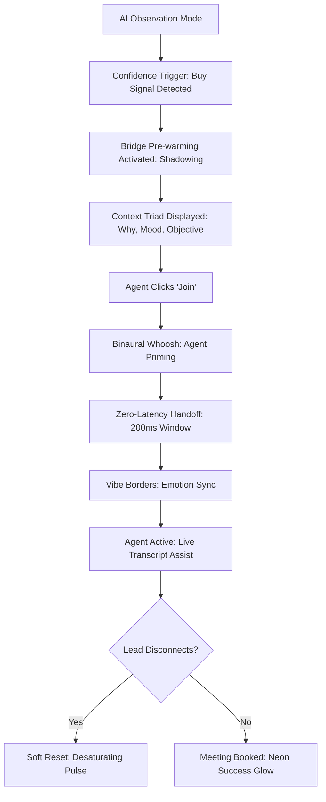
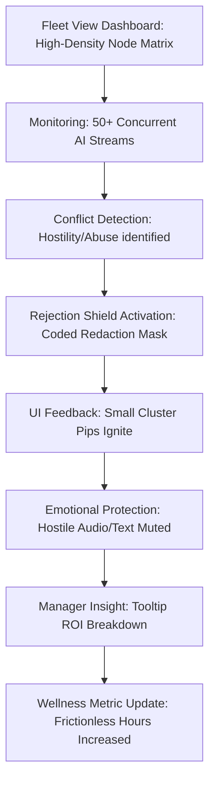

stepsCompleted: [1, 2, 3, 4, 5, 6, 7, 8, 9, 10, 11, 12, 13]
currentStep: 14
status: "Final Review & Handoff"
inputDocuments:
  - "/Users/sherwingorechomante/call/_bmad-output/planning-artifacts/prd.md"
  - "/Users/sherwingorechomante/call/_bmad-output/planning-artifacts/product-brief-call-2026-03-16.md"
---

# UX Design Specification AI Cold Caller SaaS

**Author:** team mantis a
**Date:** 2026-03-16

---

## Executive Summary

### Project Vision
AI Cold Caller SaaS aims to redefine outbound sales by making AI a universal business partner for agencies and businesses. It solves the "Agency Bottleneck" and compliance barriers through a high-velocity "10-Minute Promise," RAG-powered personalization, and integrated compliance-by-design.

### Target Users
*   **Solo Sam (Solopreneur):** Values affordability and time-savings; seeks an outcome-based "launch-and-forget" experience.
*   **Growth-Stage Grace (SME Owner):** Hybrid user managing both AI volume and human high-value leads; needs CRM integration.
*   **Agency Alex (Agency Manager):** Power user managing multi-tenant hierarchies; requires branding flexibility and white-labeling.
*   **Agent Avery (Call Agent):** Operational user requiring high-efficiency cockpit UI to execute human-mode calls with AI support.

### Key Design Challenges
*   **Onboarding Velocity:** Balancing thoroughness (KB ingestion, script tuning) with the <10m launch target.
*   **Context Management:** Providing clear visual separation and navigation across Agency > Client > Lead layers.
*   **AI Explainability:** Building trust in generated scripts and objection handles through early "proof-of-concepts" like sample calls.

### Design Opportunities
*   **The Rejection Shield:** Proactive morale management for sales teams by filtering hostility from feeds.
*   **Warm Transfer UI:** Seamlessly bridging AI-to-Human transitions with full context preservation.
*   **Progressive Performance:** Showing "Aha!" moments early via analytics momentum tracking.

# 3. Core Experience
[... content remains as is ...]

# 4. Desired Emotional Response

## Primary Emotional Goals
- **Elite Empowerment (Coordination over Rescue)**: The transition from AI to Human should feel like activating a specialized tool, reinforcing the user’s role as an elite operator.
- **Psychological Security (Untouchable Defense)**: The 100% rejection shield ensures users feel calm and ready, isolated from verbal aggression.
- **Ready Calm (The Biofeedback Heartbeat)**: A rhythmic base-state of focus, maintained through subtle UI cues.

## Emotional Journey Mapping
- **First Discovery**: **Intrigued & Hopeful**. The "10-Minute Promise" and "Rejection Shield" offer immediate relief from traditional cold-calling pains.
- **Core Experience**: **Flow State Focus**. Visual "Heat Mapping" and a subtle "Pulse-Maker" maintain a steady emotional tempo.
- **Task Completion**: **Triumphant Impact**. Seeing "Morale Saved" and "Meetings Booked" provides high-value professional dopamine.
- **Failure Recovery**: **Analytic Growth**. AI "Differential Insights" turn missed opportunities into training moments, building long-term trust.

## Micro-Emotions
- **Trust**: Solidified via **AI Learning Transparency**—showing the model's self-correction after negative outcomes.
- **Anticipation**: The heat-map creates a "hunting" instinct for the right conversation.
- **Relief**: High-frequency emotional ROI through the "Rejection Blocked" pulse.

## Design Implications
- **Pulse-Maker**: Implement a subtle, rhythmic visual pulse in the UI that quickens when a call transitions from 'Cold' to 'Hot'.
- **Comparative ROI**: Dashboard must visualize "Total Rejections Handled" in terms of "Agent Hours Saved" to quantify the shield's value.
- **Transparency Toggles**: Allow users to see the model's "Differential Insight" to understand *why* the AI is suggesting specific script changes.

## Step 5: Inspiration Analysis

### Inspiration Sources & Transferable Patterns
- **Trading Apps (Fintech):**
    - **Sentiment Ticker:** A high-density, real-time telemetry feed of call sentiment sub-harmonics.
    - **Fleet View:** A "Command Center" dashboard for managers to monitor sentiment velocity across multiple agents/AIs simultaneously using a "Heat Ripple" visual system.
- **Slack:**
    - **Threaded Context:** A synchronized playhead with a 30-second threaded transcript window for human agents to "catch up" instantly before joining a call.
- **HubSpot/CRMs:**
    - **Contextual Sidebars:** High-relevance lead data served only when necessary to reduce cognitive load.

### Anti-Patterns to Avoid
- **"Wall of Text":** Avoiding static, overwhelming data displays; prioritizing dynamic, exception-based triggers.
- **"Ghost in the Machine":** Ensuring AI reasoning and "morale saving" metrics (Rejection Shield ROI) are transparent and quantifiable.

## Step 6: Design System Foundation

### 1.1 Design System Choice
- **Approach:** Full Custom Design System (Option 1).
- **Tech Stack:** Radix UI (Logic/Accessibility) + Vanilla CSS (Aesthetic Control).

### Rationale for Selection
- **Visual Identity Moat:** To differentiate from generic SaaS tools and establish a premium, "Elite Operator" feel.
- **Micro-Interaction Budget:** Enables bespoke "Sentiment Velocity" visualizations and "Pulse" rhythms that standard libraries cannot deliver without bloat.
- **Performance Optimization:** Eliminates unused library styles, ensuring the low-latency required for real-time AI telemetry.

### Implementation Approach
- **Foundational Tax:** Prioritizing custom primitives for the **Agent Cockpit** and **Fleet View**.
- **Thematic Consistency:** Utilizing CSS variables/Design Tokens for all core UI states (Cold/Warm/Hot).

### Customization Strategy
- **Glassmorphism:** Leveraging translucency and depth to create a futuristic "Command Bridge" aesthetic.
- **Neon Telemetry:** Using vibrant accent colors for high-signal data points against an obsidian-dark background.

## Step 7: Defining the Core Experience (The Master Join)

### 1.1 The "Aha!" Moment: The Master Join
The moment an agent transitions from "Observer/Manager" to "Active Closer" must feel like a seamless power-up.

### 1.2 User Mental Model
- **The F1 Pit Stop:** The AI handles the "heavy lifting" (dialing, rejection, basic screening). The Human is the specialist who jumps in to finish the race.
- **Joining a Mission in Progress:** The user isn't starting a call; they are entering a tactical scenario already in motion.

### 1.3 Success Criteria
- **Zero-Latency Context:** <200ms from "Join" click to full audio/visual availability.
- **Emotional Synchronization:** The agent enters at the exact energy level required by the lead's current sentiment.
- **Lead Invisibility:** The transition must be completely undetectable to the prospect (No "click," "beep," or silence).

### 1.4 Experience Mechanics
- **Audio Priming:** A subtle **"Binaural Whoosh"** plays for 0.5s in the agent's stereo field to induce focus without leaking to the lead's audio stream.
- **Visual Vibe Borders:** 
    - **Adaptive Training:** If the lead is aggressive, the UI displays a **Jagged Red Glow** that slowly transitions to a **Soothing Green/Blue** as the agent de-escalates.
- **Flash Catch-up (Context Triad):** Three high-density bullet points displayed above the Join button:
    1. **Context:** Why the AI is handing over (e.g., "Price Objection").
    2. **Sentiment Check:** High-fidelity mood label (e.g., "Skeptical but Curious").
    3. **Success Mission:** The immediate goal (e.g., "Show ROI proof now").
- **Audio Buffer Safety:** A silent 500ms buffer during the "Join" phase to detect instant hang-ups before the Human agent speaks, preventing "dead-air" awkwardness.

## Step 8: Visual Design Foundation

### 1.1 Color System (Obsidian & Neon)
- **Base Environment:** Obsidian Black (`#09090B`) with high-depth layering.
- **Surface Strategy:** Glassmorphism with variable translucency (40% for subtle overlays, 70% for active panels) to maintain context.
- **Signal Colors (Neon Telemetry):**
    - **Success/Hot:** Neon Emerald (`#10B981`)
    - **Warning/Aggressive:** Vivid Crimson (`#F43F5E`)
    - **Neutral/Ready:** Electric Blue (`#3B82F6`)
    - **Inactive/Cold:** Muted Zinc (`#3F3F46`)
- **Accessibility:** All signal states must include a secondary indicator (e.g., icons, varying stroke thickness) to ensure accessibility beyond color.

### 1.2 Typography System (The Modern Operator)
- **Primary Typeface:** **Geist Sans** (Geometric Sans). Used for interface labels, headings, and primary navigation. Ensures a "Premium Fintech" feel.
- **Telemetry Typeface:** **Geist Mono** (Monospace). Used specifically for numbers, timestamps, and real-time transcripts to ensure precise data alignment and a "Mission Control" technical aesthetic.
- **Type Scale:** Compact and tactical. 
    - **Labels:** 11px All-Caps (Letter-spacing: 0.05em).
    - **Data Rows:** 13px Mono (Tabular numbers enabled).
    - **Readability:** High-contrast white (`#FAFAFA`) on dark, with 1.5x line-height for transcripts.

### 1.3 Spacing & Layout Foundation
- **Base Grid:** 4x4 Grid System.
- **Layout Density:** 
    - **Agent Cockpit & Fleet View:** High-Density. Designed to minimize lateral eye movement; all critical data visible without scrolling.
    - **Onboarding & Configuration:** Spacious (Progressive Disclosure). Lower density to reduce cognitive friction during setup.
- **Layout Principle:** "The Command Bridge." Centralized call telemetry flanked by collapsible sidebar "Modules" (Lead Data, Script Navigator, History).

### 1.4 Accessibility Considerations
- **High-Contrast Dark Mode:** WCAG AAA targets for all primary text elements.
- **Motion Reduction:** Option to disable the "Pulse-Maker" and "Heat Ripples" for users sensitive to motion.

## Step 9: Design Direction (Hybrid Evolution)

### 1.1 Selected Direction: The Hybrid Evolution
Based on collaborative evaluation, the product will follow a "Hybrid Evolution" strategy that balances high-velocity onboarding with high-fidelity operational control.

### 1.2 Aesthetic Components
- **Base Environment (The Stealth Closer):** Sleek, professional "Obsidian" layout with hairline borders and minimal clutter. Used as the global foundation.
- **Data Layers (The Tactical Cockpit):** High-density telemetry blocks using `Geist Mono` and tabular-nums for vertical alignment. Applied to all real-time data streams.
- **Interaction Rituals (The Ethereal Pulse):** Glassmorphism and "Magic" glows (Atmospheric Glow) are reserved for the **Master Join** and high-value success states (Meetings Booked).
- **Onboarding (Minimalist Zen):** A low-friction, high-whitespace "Zen" mode for the 10-Minute Promise, which "boots up" into the cockpit.

### 1.3 The "Becoming the Closer" Ritual (Launch Sequence)
- **Transition logic:** Upon completion of setup, the Zen UI initiates a "System Boot" sequence.
- **Visuals:** Grid lines scan the screen, obsidian panels slide into place, and Neon accents ignite from the center out. 
- **Emotional Impact:** Moves the user from the "Peace of Setup" to the "Adrenaline of the Mission."

### 1.4 Typography & Lighting
- **Typography:** **Geist Mono** is mandated for transcripts to provide a "Radio Rhythm" that makes scanning rapid speech more efficient.
- **Lighting Profile:** **Atmospheric Magic**. Neons use soft blooms and subtle gradients to feel like a premium, sentient AI partner rather than a cold medical device.

## Step 10: User Journey Flows

### 1.1 The "10-Minute Launch" (Onboarding & Ritual)
Goal: Rapid transition from setup to operation with minimal friction.

**Key Moments:**
- **Pre-Flight Calibration:** Hides background ingestion time (PDF parsing) by engaging the user in low-stakes customization.
- **System Boot Ritual:** A visceral state-change animation that shifts the user's mindset from "Setup" to "Mission."

### 1.2 The "Master Join" (Live Tactical Interaction)
Goal: Zero-latency context handoff from AI to Human Agent.

**Key Moments:**
- **Bridge Pre-warming:** Technical shadow-loading of audio bridges based on confidence scores to guarantee zero-latency.
- **The Context Triad:** Rapid-burst data delivery (3 bullet points) ensures the agent enters the call already briefed.
- **Desaturating Pulse:** A "Soft Reset" for the agent's focus if the call fails mid-join, preventing emotional jarring.

### 1.3 The "Fleet Pulse" & Rejection Shield
Goal: High-density management for Agency managers with proactive morale protection.

**Key Moments:**
- **Coded Redaction:** Hostile leads are masked via "Moving Data Blocks" rather than simple filtering, highlighting the AI's role as a Digital Shield-Bearer.
- **Clustered Pips:** Low-density visual indicators prevent dashboard noise while maintaining "Invisibility" ROI for managers.
- **Wellness Metric:** Quantifying success not just in sales, but in "Frictionless Hours" (Turnover avoidance ROI).

### 1.4 Journey Patterns
- **Entry Points:** All active operation starts with the "Ritual" (Transition from Zen to Obsidian).
- **Navigation:** High-density telemetry (Fleet View) utilizes "Inspectable Tooltips" to preserve density while providing deep data.
- **Feedback:** Successes are signaled by **Atmospheric Magic** (Pulse/Glow), Failures by **Tactical Desaturation** (Grey-out).

## Step 11: Component Strategy

### Design System Components
We leverage **Radix UI** for foundational primitives to ensure industry-standard accessibility and functional reliability (Pragmatism).

- **Available Primitives:** `Dialog` (Modals), `Tooltip` (Context help), `Popover` (Master Join briefings), `ScrollArea` (Transcript tracking), `Tabs` (Dashboard views), `Switch` (AI toggles).
- **Styling Layer:** All Radix primitives are skinned with **Pure CSS** using Obsidian variable translucency and Neon borders.

### Custom Components
Custom components are designed for the high-performance "Tactical" requirements of the AI Cold Caller core experience (Poetry).

#### [CockpitContainer]
- **Purpose:** Top-level application shell that handles the state-transition from Zen to Obsidian.
- **Anatomy:** Translucent glass surface, 4x4 Grid overlay, Ambient Neon Glow (`#0EA5E9` pulse).
- **Interactions:** Injects the "System Boot" ritual on activation.

#### [VibeBorder]
- **Purpose:** Reactive emotional border around the call interface.
- **States:** 
  - `Neutral`: Static Zinc-700.
  - `Positive`: Emerald pulse (Ease-in, 800ms).
  - `Hostile`: Crimson "Jitter" (Linear, high-frequency) + Coded Redaction mask.
- **Accessibility:** ARIA live region updates for screen readers reflecting sentiment change.

#### [ContextTriad]
- **Purpose:** High-contrast tactical briefing for Master Join events.
- **Content:** Three bullet points in `Geist Mono`: **WHY** (Urgency), **MOOD** (Sentiment), **TARGET** (Success path).
- **Interaction:** Automatically appears in the peripheral vision space of the agent during the "Binaural Whoosh."

#### [GlitchPip]
- **Purpose:** Micro-indicator for the Rejection Shield in high-density views.
- **Anatomy:** 4x4px div with "Coded Redaction" CSS keyframe animation mimicking moving data blocks.

#### [TelemetryStream]
- **Purpose:** Optimized transcript feed.
- **Typography:** Strictly `Geist Mono` at 13px for maximum data scannability.

### Component Implementation Strategy
- **Token First:** All custom components must consume variables from the Step 8 Visual Foundation (Typography, Colors).
- **State Driven:** Components like `VibeBorder` and `GlitchPip` are reactive, driven by the real-time telephony event stream.
- **Performance:** CSS-heavy animations (transforms, opacity) used over JavaScript whenever possible to maintain 60fps on high-density Agency dashboards.

### Implementation Roadmap
1.  **Phase 1 (Core):** `CockpitContainer`, `TelemetryStream`, `ContextTriad`. (Essential for the "Master Join" MVP).
2.  **Phase 2 (Tactical):** `VibeBorder`, `GlitchPip`. (Establishing the "Elite Operator" identity).
3.  **Phase 3 (Optimization):** `NodeMatrix` clustering for high-density Agency views and cross-platform responsive containers.

## Step 12: UX Consistency Patterns

### 1.1 Button Hierarchy & Action Patterns
Standardizing the interaction language between Tactical and Administrative states.

- **Primary Tactical (Neon Emerald/Blue):** High-glow buttons for mission-critical actions (`Join Call`, `Go Live`).
- **Secondary Logical (Zinc-800):** Clean, translucent borders for workflow management (`Skip`, `Edit Script`).
- **Destructive (Crimson Ghost):** Thin red neon border for permanent actions (`Delete Script`).
- **Disabled State:** 20% opacity with a "Desaturated" filter.

### 1.2 Feedback Patterns (Adaptive Atmospheric Magic)
A two-tier system that balances emotional reward for agents with tactical clarity for managers.

- **The "Success Bloom":**
  - **Agent Mode:** Full volumetric Emerald bloom floods the container (1500ms ease-out) + subtle "Bell Shine" audio.
  - **Fleet View:** Subdued 2px neon border pulse to maintain dashboard focus.
- **The "Context Flicker":** High-speed 100ms dimming if the AI confidence drops, signaling a need for human attention.
- **The "Glitch Recovery":** Failed actions trigger a 200ms "Digital Glitch" animation on the specific affected node, rather than a jarring pop-up modal.

### 1.3 Interaction Recovery & Focus Protection
- **The "Desaturation Pulse":** If a lead hangs up mid-join, the UI pulses to Zinc-grey for 1000ms. This acts as a "Cognitive Reset" for the agent.
- **The "Telemetry Anchor":** High-speed transcripts are "Bottom-Anchored" (scrolling up) to mimic the rhythm of radio telemetry.

### 1.4 User Preferences (The "Vibe" Slider)
Users can customize the "Loudness" of the UI feedback.
- **Stealth Mode (0%):** Minimal glows, no audio feedback, high-density focus.
- **Ritual Mode (100%):** Full volumetric blooms, Binaural transitions, high emotional ROI.

## Step 13: Responsive Design & Accessibility

### 1.1 Responsive Strategy (The "Fluid Cockpit")
Ensuring the "Elite Operator" experience scales from global agency oversight down to individual agent alerts.

- **Desktop (Command Center):** Full 3-column layout (Fleet Navigator, Active Telemetry, Actions/Metrics). Optimized for multi-monitor setups.
- **Tablet (Tactical):** Simplified 2-column view with slide-over drawers for secondary data. Touch targets expanded to 44px for high-stress actions like `Takeover`.
- **Mobile (Pocket Sentinel):** Single-column dashboard focusing on "Health Metrics" and critical alerts. Actions limited to `Stop All` or `Review Transcription` via deep link.

### 1.2 Breakpoint Strategy
- **Mobile:** `< 768px` (Fluid single column, persistent bottom action bar).
- **Tablet:** `768px - 1024px` (Stacked cards, hidden sidebars).
- **Desktop:** `> 1024px` (Full 3-tier adaptive layout).
- **Wide:** `> 2560px` (Inner container capped at 1920px for eye-tracking safety).

### 1.3 Accessibility Strategy (WCAG AA)
- **Visual:** High-contrast Neon on Zinc (4.5:1 ratio). Critical states use "Shape + Color" (e.g., GlitchPip icons accompaniment to status glows).
- **Cognitive:** "Vibe Intensity" slider allows reducing motion/noise for users with light/motion sensitivity.
- **Interaction:** Semantic HTML5 landmarks for screen reader navigation. Focus-visible rings on all interactive `GlassContainer` elements.

### 1.4 Testing Strategy
- **Automated:** Axe-core integrated into the CI/CD pipeline.
- **Manual:** Keyboard-only navigation audits for complex Telemetry Stream interactions.
- **Visual:** Cross-browser regression testing on dark-mode rendering (Safari vs. Chrome filter effects).

---

<!-- UX design content will be appended sequentially through collaborative workflow steps -->

