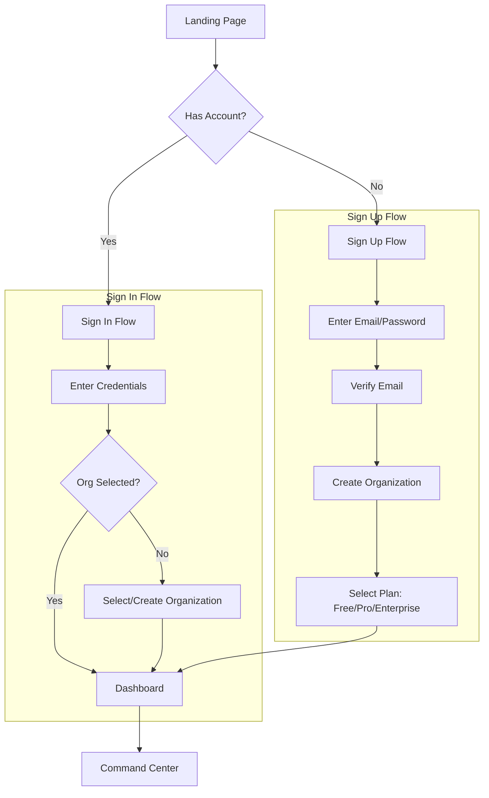
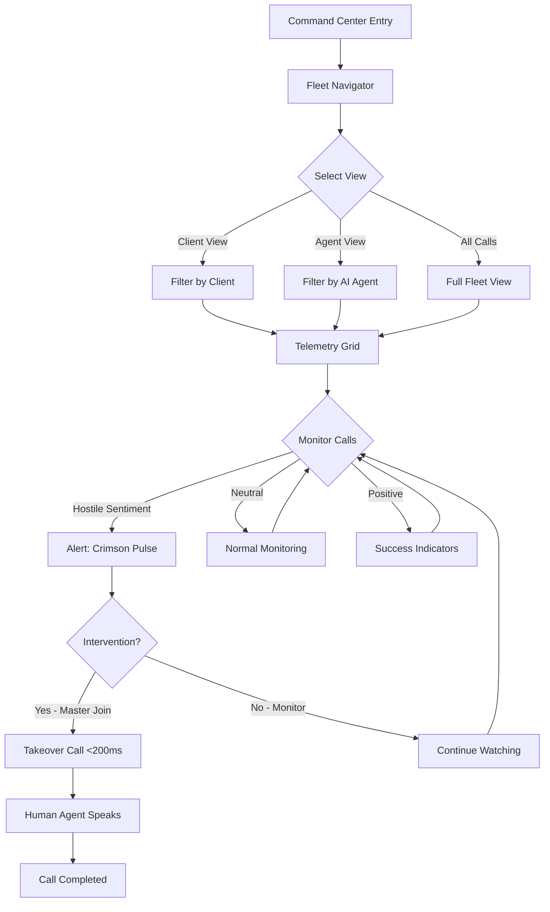
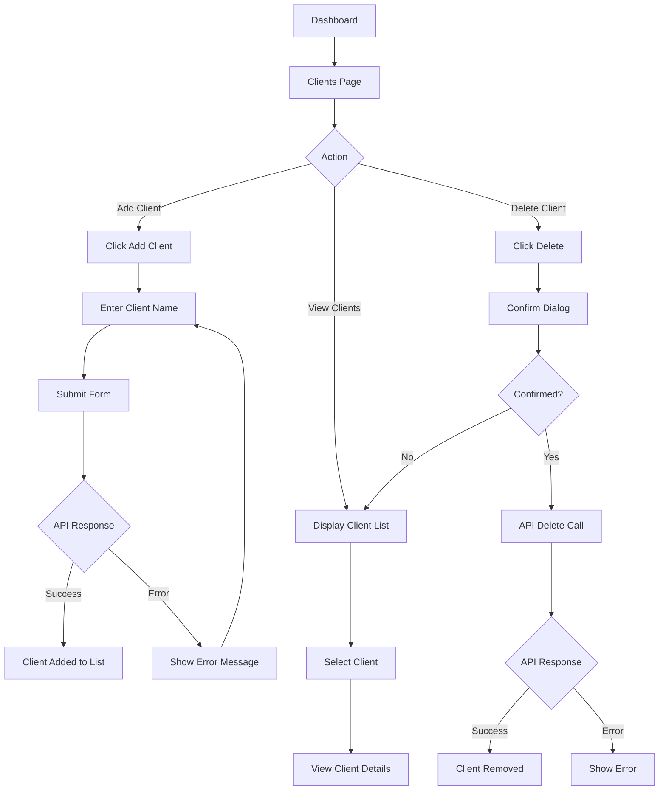
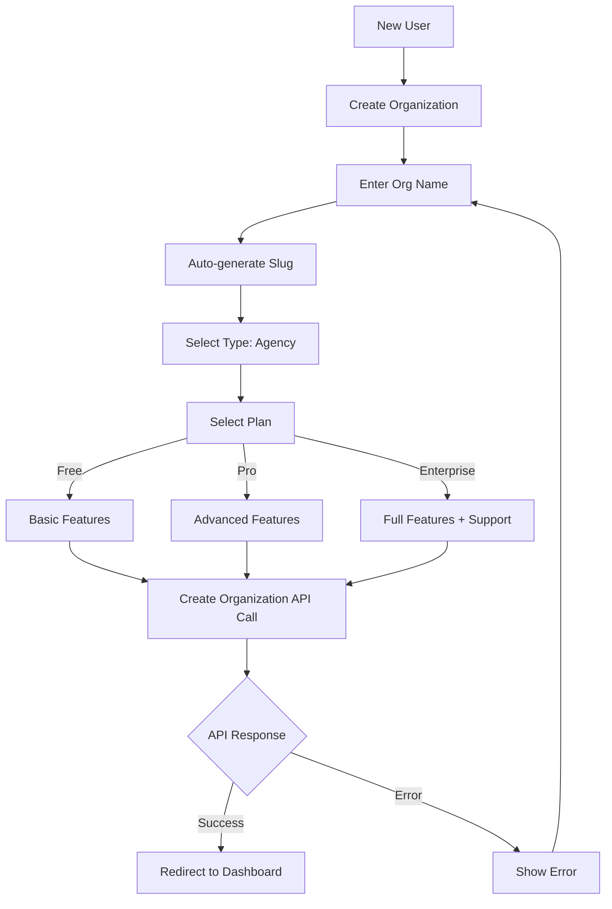

# AI Cold Caller SaaS - User Journey Workflow Diagrams

> **Document Purpose:** This document provides detailed user journey workflow diagrams to serve as input for AI design tool UI/screen development.

---

## Table of Contents

1. [Application Overview](#1-application-overview)
2. [User Personas](#2-user-personas)
3. [Core User Journeys](#3-core-user-journeys)
4. [Screen Specifications](#4-screen-specifications)
5. [State Flows](#5-state-flows)
6. [Interaction Patterns](#6-interaction-patterns)

---

## 1. Application Overview

### Product Vision
AI Cold Caller is a **multi-tenant SaaS platform** for agencies and SMEs to:
- Generate AI cold call scripts
- Convert scripts into natural AI voice
- Launch outbound call campaigns
- Monitor real-time AI call performance
- Track campaign analytics

### Tech Stack
| Layer | Technology |
|-------|------------|
| Frontend | Next.js 15 (App Router) |
| Backend | FastAPI (Python) |
| Auth | Clerk (Organization-aware) |
| Database | PostgreSQL + SQLModel |
| Telephony | Vapi |
| Design | "Obsidian" Theme (Dark with Neon accents) |

---

## 2. User Personas

### Persona A: Agency Admin (Marcus)
```
┌─────────────────────────────────────────────────────────────┐
│  AGENCY ADMIN                                                │
├─────────────────────────────────────────────────────────────┤
│  Role: org:admin                                             │
│  Goals:                                                      │
│  • Monitor 50+ concurrent AI streams across 5 clients        │
│  • Identify high-value calls requiring human takeover        │
│  • Manage client accounts and settings                       │
│  • View comprehensive analytics                              │
│                                                              │
│  Pain Points:                                                │
│  • Need real-time visibility into call sentiment             │
│  • Want <500ms latency for hostile sentiment detection       │
│  • Need <200ms "Master Join" handoff transitions             │
│                                                              │
│  Permissions:                                                │
│  ✓ Full dashboard access                                     │
│  ✓ Create/Delete clients                                     │
│  ✓ Manage organization settings                              │
│  ✓ Invite team members                                       │
└─────────────────────────────────────────────────────────────┘
```

### Persona B: Agency Member (Sarah)
```
┌─────────────────────────────────────────────────────────────┐
│  AGENCY MEMBER                                               │
├─────────────────────────────────────────────────────────────┤
│  Role: org:member                                            │
│  Goals:                                                      │
│  • Monitor assigned client calls                             │
│  • Execute call interventions when needed                    │
│  • View client-specific analytics                            │
│                                                              │
│  Pain Points:                                                │
│  • Limited to assigned clients only                          │
│  • Cannot modify organization settings                        │
│                                                              │
│  Permissions:                                                │
│  ✓ View assigned clients                                     │
│  ✗ Cannot create/delete clients                              │
│  ✗ Cannot manage org settings                                │
└─────────────────────────────────────────────────────────────┘
```

---

## 3. Core User Journeys

### Journey 1: New User Onboarding



#### Screen Flow Diagram:
```
┌──────────────┐     ┌──────────────┐     ┌──────────────┐
│  LANDING     │────▶│  SIGN UP     │────▶│  VERIFY      │
│  PAGE        │     │  /sign-up    │     │  EMAIL       │
└──────────────┘     └──────────────┘     └──────────────┘
        │                                          │
        │              ┌──────────────┐            │
        └─────────────▶│  SIGN IN     │◀───────────┘
                       │  /sign-in    │
                       └──────────────┘
                              │
                              ▼
                       ┌──────────────┐
                       │  CREATE ORG   │
                       │  /dashboard/  │
                       │  orgs/new     │
                       └──────────────┘
                              │
                              ▼
                       ┌──────────────┐
                       │  COMMAND     │
                       │  CENTER      │
                       │  /command-   │
                       │  center      │
                       └──────────────┘
```

---

### Journey 2: Command Center Operations (Primary Use Case)



#### Command Center Layout:
```
┌──────────────────────────────────────────────────────────────────────────────────┐
│                           HEADER: COMMAND CENTER                                 │
│  [Logo] [Nav: COMMAND CENTER | CAMPAIGNS | ANALYTICS]     [Search] [Bell] [⚙]  │
├────────────────┬─────────────────────────────────────────┬────────────────────────┤
│                │                                         │                    │
│  FLEET          │        TELEMETRY GRID                  │   REJECTION SHIELD  │
│  NAVIGATOR      │                                        │   & METRICS         │
│                │  ┌─────────────────┬─────────────────┐  │                    │
│  ┌────────────┐│  │ Call Node A     │ Call Node B     │  │  ┌──────────────┐ │
│  │ PHOENIX-01 ││  │ [Waveform]      │ [Waveform]      │  │  │   12.4%      │ │
│  │ ● Active   ││  │ [Transcript]    │ [Transcript]    │  │  │  Rejection   │ │
│  │ 124 calls  ││  │ [Sentiment: ●]  │ [Sentiment: ●]  │  │  │    Rate      │ │
│  └────────────┘│  │ [JOIN button]   │ [JOIN button]   │  │  └──────────────┘ │
│                │  ├─────────────────┼─────────────────┤  │                    │
│  ┌────────────┐│  │ Call Node C     │ Call Node D     │  │  Active: 42       │
│  │ TITAN-04   ││  │ [Waveform]      │ [Waveform]      │  │  Conversion: 8.2% │
│  │ ● Active   ││  │ [Transcript]    │ [Transcript]    │  │  Sentiment: DECENT│
│  │ 89 calls   ││  │ [Sentiment: ●]  │ [Sentiment: ●]  │  │                    │
│  └────────────┘│  │ [JOIN button]   │ [JOIN button]   │  │  Quick Actions:    │
│                │  └─────────────────┴─────────────────┘  │  [Verify Compliance]│
│  ┌────────────┐│                                         │  [Send Prompt]     │
│  │ SHADOW-09  ││  ─────────────────────────────────────  │                    │
│  │ ○ Standby  ││  [Waiting for input...] [INTERVENE]     │                    │
│  │ 210 calls  ││                                         │                    │
│  └────────────┘│                                         │                    │
│                │                                         │                    │
│  SYSTEM HEALTH │                                         │                    │
│  ████████░░ 94%│                                         │                    │
└────────────────┴─────────────────────────────────────────┴────────────────────────┘
```

---

### Journey 3: Client Management (Agency Admin Only)



#### Client Management Screen:
```
┌─────────────────────────────────────────────────────────────────┐
│  CLIENTS                              [+ Add Client]            │
├─────────────────────────────────────────────────────────────────┤
│                                                                 │
│  ┌─────────────────────────────────────────────────────────┐   │
│  │ Client: Acme Corp                                       │   │
│  │ Created: March 15, 2026                      [Delete]   │   │
│  └─────────────────────────────────────────────────────────┘   │
│                                                                 │
│  ┌─────────────────────────────────────────────────────────┐   │
│  │ Client: TechStart Inc                                   │   │
│  │ Created: March 10, 2026                      [Delete]   │   │
│  └─────────────────────────────────────────────────────────┘   │
│                                                                 │
│  ┌─────────────────────────────────────────────────────────┐   │
│  │ Client: Solar Solutions                                 │   │
│  │ Created: March 8, 2026                       [Delete]   │   │
│  └─────────────────────────────────────────────────────────┘   │
│                                                                 │
└─────────────────────────────────────────────────────────────────┘

┌─────────────────────────────────────────────────────────────────┐
│  ADD CLIENT FORM (Modal/Inline)                                 │
├─────────────────────────────────────────────────────────────────┤
│                                                                 │
│  Client Name: [________________________]                        │
│                                                                 │
│  [Create]  [Cancel]                                             │
│                                                                 │
└─────────────────────────────────────────────────────────────────┘
```

---

### Journey 4: Organization Setup



#### Organization Creation Screen:
```
┌─────────────────────────────────────────────────────────────────┐
│                                                                 │
│                    CREATE ORGANIZATION                          │
│                                                                 │
├─────────────────────────────────────────────────────────────────┤
│                                                                 │
│  Organization Name                                              │
│  [________________________]                                     │
│                                                                 │
│  Type                                                           │
│  [Agency ▼]                                                     │
│                                                                 │
│  Plan                                                           │
│  ○ Free    ● Pro    ○ Enterprise                               │
│                                                                 │
│  ┌─────────────────────────────────────────────────────────┐   │
│  │              [Create Organization]                       │   │
│  └─────────────────────────────────────────────────────────┘   │
│                                                                 │
└─────────────────────────────────────────────────────────────────┘
```

---

## 4. Screen Specifications

### Screen 1: Landing Page (`/`)

| Property | Value |
|----------|-------|
| **Route** | `/` |
| **Auth Required** | No |
| **Purpose** | Entry point, brand introduction |
| **CTA** | "Enter Command Center" button |

```
┌─────────────────────────────────────────────────────────────────┐
│                                                                 │
│                                                                 │
│                                                                 │
│              TITAN COLD CALLER                                  │
│                                                                 │
│         [Enter Command Center]                                  │
│                                                                 │
│                                                                 │
│                                                                 │
└─────────────────────────────────────────────────────────────────┘
```

**User Actions:**
1. View brand/logo
2. Click "Enter Command Center" → Redirects to `/command-center` (auth check)

---

### Screen 2: Sign In (`/sign-in/[[...sign-in]]`)

| Property | Value |
|----------|-------|
| **Route** | `/sign-in/*` |
| **Auth Required** | No (public) |
| **Component** | Clerk `<SignIn />` |
| **Post-Auth Redirect** | `/dashboard` |

```
┌─────────────────────────────────────────────────────────────────┐
│                                                                 │
│                    SIGN IN                                      │
│                                                                 │
│  ┌─────────────────────────────────────────────────────────┐   │
│  │  Email                                                   │   │
│  │  [________________________]                              │   │
│  │                                                          │   │
│  │  Password                                                │   │
│  │  [________________________]                              │   │
│  │                                                          │   │
│  │  [Continue with Email]                                   │   │
│  │                                                          │   │
│  │  ─────────── or ───────────                             │   │
│  │                                                          │   │
│  │  [Continue with Google]                                  │   │
│  │  [Continue with GitHub]                                  │   │
│  │                                                          │   │
│  │  Don't have an account? Sign up                         │   │
│  └─────────────────────────────────────────────────────────┘   │
│                                                                 │
└─────────────────────────────────────────────────────────────────┘
```

---

### Screen 3: Sign Up (`/sign-up/[[...sign-up]]`)

| Property | Value |
|----------|-------|
| **Route** | `/sign-up/*` |
| **Auth Required** | No (public) |
| **Component** | Clerk `<SignUp />` |
| **Post-Auth Redirect** | `/dashboard` |

```
┌─────────────────────────────────────────────────────────────────┐
│                                                                 │
│                    CREATE ACCOUNT                               │
│                                                                 │
│  ┌─────────────────────────────────────────────────────────┐   │
│  │  Email                                                   │   │
│  │  [________________________]                              │   │
│  │                                                          │   │
│  │  Password                                                │   │
│  │  [________________________]                              │   │
│  │                                                          │   │
│  │  [Continue with Email]                                   │   │
│  │                                                          │   │
│  │  ─────────── or ───────────                             │   │
│  │                                                          │   │
│  │  [Continue with Google]                                  │   │
│  │  [Continue with GitHub]                                  │   │
│  │                                                          │   │
│  │  Already have an account? Sign in                       │   │
│  └─────────────────────────────────────────────────────────┘   │
│                                                                 │
└─────────────────────────────────────────────────────────────────┘
```

---

### Screen 4: Command Center (`/command-center`)

| Property | Value |
|----------|-------|
| **Route** | `/command-center` |
| **Auth Required** | Yes |
| **Layout** | 3-column (Sidebar + Main + Metrics) |
| **Real-time** | WebSocket telemetry updates |

#### Layout Zones:

**A. Fleet Navigator (Left Sidebar - 280px)**
```
┌────────────────────┐
│ FLEET NAVIGATOR    │
├────────────────────┤
│                    │
│ ┌────────────────┐│
│ │ PHOENIX-01     ││
│ │ ● Active       ││
│ │ 📞 124 Calls   ││
│ └────────────────┘│
│                    │
│ ┌────────────────┐│
│ │ TITAN-04       ││
│ │ ● Active       ││
│ │ 📞 89 Calls    ││
│ └────────────────┘│
│                    │
│ ┌────────────────┐│
│ │ SHADOW-09      ││
│ │ ○ Standby      ││
│ │ 📞 210 Calls   ││
│ └────────────────┘│
│                    │
├────────────────────┤
│ ⚡ SYSTEM HEALTH   │
│ ████████░░ 94%     │
└────────────────────┘
```

**B. Main Telemetry (Center - Flexible)**
```
┌─────────────────────────────────────────────────────────────────┐
│ ┌── LIVE ─┐  Active Call: PHOENIX-01                            │
│           │  MAIN TELEMETRY                    [Positive|Neutral|Negative] │
├─────────────────────────────────────────────────────────────────┤
│                                                                 │
│  ┌─────────────────────────────────────────────────────────┐   │
│  │ ═════════════════════════════════════════════════════   │   │
│  │  (Sentiment Color Bar - pulses based on call sentiment) │   │
│  │ ═════════════════════════════════════════════════════   │   │
│  ├─────────────────────────────────────────────────────────┤   │
│  │                                                         │   │
│  │  10:24:01  [AI]    Good morning! Am I speaking...       │   │
│  │  10:24:04  [LEAD]  Yeah, who's this?                    │   │
│  │  10:24:06  [SYS]   Sentiment Shift: Neutral → Defensive │   │
│  │  10:24:08  [AI]    This is Alex from Titan Solar...     │   │
│  │  10:24:12  [LEAD]  Not interested. We already have...   │   │
│  │  10:24:14  [SYS]   ⚠ Objection: Already Owns Product    │   │
│  │                                                         │   │
│  ├─────────────────────────────────────────────────────────┤   │
│  │ ● Waiting for input...              [INTERVENE]         │   │
│  └─────────────────────────────────────────────────────────┘   │
│                                                                 │
│  Metrics: Ping: 24ms | Status: Stable                          │
│                                                                 │
└─────────────────────────────────────────────────────────────────┘
```

**C. Rejection Shield & Metrics (Right Panel - 320px)**
```
┌────────────────────────────┐
│ REJECTION SHIELD           │
├────────────────────────────┤
│                            │
│        ┌──────────┐        │
│        │   🛡️     │        │
│        │          │        │
│        │  12.4%   │        │
│        │Rejection │        │
│        │  Rate    │        │
│        └──────────┘        │
│                            │
├────────────────────────────┤
│ Active Calls    42   +4 ↑  │
│ Conversion     8.2%  -1.2↓ │
│ Sentiment     DECENT       │
├────────────────────────────┤
│ Shield Optimization        │
│ ████████░░ Active          │
├────────────────────────────┤
│ QUICK ACTIONS              │
│                            │
│ [✓ Verify Compliance]      │
│ [💬 Send Prompt]           │
│                            │
└────────────────────────────┘
```

---

### Screen 5: Clients Dashboard (`/dashboard/clients`)

| Property | Value |
|----------|-------|
| **Route** | `/dashboard/clients` |
| **Auth Required** | Yes (Admin for create/delete) |
| **Permission Gate** | `canCreateClient`, `canDeleteClient` |

```
┌─────────────────────────────────────────────────────────────────┐
│  CLIENTS                                    [+ Add Client]     │
├─────────────────────────────────────────────────────────────────┤
│                                                                 │
│  (If no org selected)                                           │
│  ┌─────────────────────────────────────────────────────────┐   │
│  │  Please select an organization to manage clients.       │   │
│  └─────────────────────────────────────────────────────────┘   │
│                                                                 │
│  (If loading)                                                   │
│  ┌─────────────────────────────────────────────────────────┐   │
│  │  Loading clients...                                     │   │
│  └─────────────────────────────────────────────────────────┘   │
│                                                                 │
│  (Client List)                                                  │
│  ┌─────────────────────────────────────────────────────────┐   │
│  │  Acme Corp                           [Delete]           │   │
│  │  Created March 15, 2026                                 │   │
│  └─────────────────────────────────────────────────────────┘   │
│                                                                 │
│  ┌─────────────────────────────────────────────────────────┐   │
│  │  TechStart Inc                        [Delete]          │   │
│  │  Created March 10, 2026                                 │   │
│  └─────────────────────────────────────────────────────────┘   │
│                                                                 │
└─────────────────────────────────────────────────────────────────┘
```

---

### Screen 6: New Organization (`/dashboard/organizations/new`)

| Property | Value |
|----------|-------|
| **Route** | `/dashboard/organizations/new` |
| **Auth Required** | Yes |
| **Purpose** | First-time org setup |

```
┌─────────────────────────────────────────────────────────────────┐
│                                                                 │
│                    CREATE ORGANIZATION                          │
│                                                                 │
├─────────────────────────────────────────────────────────────────┤
│                                                                 │
│  Organization Name                                              │
│  [________________________]                                     │
│                                                                 │
│  Type                                                           │
│  [Agency ▼]                                                     │
│                                                                 │
│  Plan                                                           │
│  ○ Free                                                         │
│  ● Pro                                                          │
│  ○ Enterprise                                                   │
│                                                                 │
│  ┌─────────────────────────────────────────────────────────┐   │
│  │              [Create Organization]                       │   │
│  └─────────────────────────────────────────────────────────┘   │
│                                                                 │
│  (Error state)                                                  │
│  ┌─────────────────────────────────────────────────────────┐   │
│  │  ⚠️ Failed to create organization                       │   │
│  └─────────────────────────────────────────────────────────┘   │
│                                                                 │
└─────────────────────────────────────────────────────────────────┘
```

---

## 5. State Flows

### 5.1 Authentication States

```
┌─────────────────────────────────────────────────────────────────────────────┐
│                         AUTHENTICATION STATE MACHINE                         │
└─────────────────────────────────────────────────────────────────────────────┘

                    ┌──────────────┐
                    │   UNAUTH     │
                    │  (Landing)   │
                    └──────┬───────┘
                           │
           ┌───────────────┼───────────────┐
           │               │               │
           ▼               ▼               ▼
    ┌──────────────┐ ┌──────────────┐ ┌──────────────┐
    │  SIGNING_UP  │ │  SIGNING_IN  │ │   OAUTH      │
    │  (Form)      │ │  (Form)      │ │  (Redirect)  │
    └──────┬───────┘ └──────┬───────┘ └──────┬───────┘
           │               │               │
           └───────────────┼───────────────┘
                           │
                           ▼
                    ┌──────────────┐
                    │  VERIFYING   │
                    │  (Email)     │
                    └──────┬───────┘
                           │
                           ▼
                    ┌──────────────┐
                    │   AUTHED     │
                    │  (Has User)  │
                    └──────┬───────┘
                           │
                    ┌──────┴───────┐
                    │              │
                    ▼              ▼
             ┌──────────┐   ┌──────────────┐
             │ HAS_ORG  │   │  NO_ORG      │
             │(Dashboard)│   │(Create Org)  │
             └──────────┘   └──────────────┘
```

### 5.2 Command Center States

```
┌─────────────────────────────────────────────────────────────────────────────┐
│                         COMMAND CENTER STATES                                │
└─────────────────────────────────────────────────────────────────────────────┘

┌────────────────────────────────────────────────────────────────────────────┐
│                                                                            │
│    ┌─────────────┐                                                        │
│    │   LOADING   │  ◀── Page initialization                               │
│    │ (Grid Scan  │                                                        │
│    │  Animation) │                                                        │
│    └──────┬──────┘                                                        │
│           │                                                                │
│           ▼                                                                │
│    ┌─────────────┐     ┌─────────────┐                                    │
│    │   EMPTY     │◀───▶│   DEFAULT   │                                    │
│    │  (Standby)  │     │  (Live)     │                                    │
│    │             │     │             │                                    │
│    │ No active   │     │ Telemetry   │                                    │
│    │ calls       │     │ streaming   │                                    │
│    └─────────────┘     └──────┬──────┘                                    │
│                              │                                             │
│                              ├──▶ ┌─────────────┐                         │
│                              │    │   ALERT     │                         │
│                              │    │ (Critical)  │                         │
│                              │    │             │                         │
│                              │    │ Crimson     │                         │
│                              │    │ pulse       │                         │
│                              │    └─────────────┘                         │
│                              │                                             │
│                              ▼                                             │
│                       ┌─────────────┐                                     │
│                       │ INTERVENE   │                                     │
│                       │ (Master     │                                     │
│                       │  Join)      │                                     │
│                       └─────────────┘                                     │
│                                                                            │
└────────────────────────────────────────────────────────────────────────────┘
```

### 5.3 Sentiment States (Vibe Border)

```
┌─────────────────────────────────────────────────────────────────────────────┐
│                         SENTIMENT STATE COLORS                               │
└─────────────────────────────────────────────────────────────────────────────┘

  POSITIVE          NEUTRAL           NEGATIVE
  ─────────        ─────────         ─────────
  #10B981          #3B82F6           #F43F5E
  (Emerald)        (Blue)            (Crimson)
  
  ┌────────────┐   ┌────────────┐    ┌────────────┐
  │════════════│   │════════════│    │════════════│
  │  PULSE     │   │  STEADY    │    │  FLASH     │
  │  GLOW      │   │  GLOW      │    │  ALERT     │
  │            │   │            │    │            │
  │  Call      │   │  Normal    │    │  Hostile   │
  │  going     │   │  conver-   │    │  sentiment │
  │  well      │   │  sation    │    │  detected  │
  └────────────┘   └────────────┘    └────────────┘
```

### 5.4 Rejection Shield States

```
┌─────────────────────────────────────────────────────────────────────────────┐
│                      REJECTION SHIELD STATUS STATES                          │
└─────────────────────────────────────────────────────────────────────────────┘

  SAFE              ALERT              CRITICAL
  ─────            ──────             ────────
  < 10%            10-20%             > 20%
  
  ┌────────────┐   ┌────────────┐    ┌────────────┐
  │    🛡️      │   │    🛡️      │    │    ⚠️      │
  │   GREEN    │   │   BLUE     │    │   RED      │
  │            │   │            │    │            │
  │  All       │   │  Elevated  │    │  High      │
  │  clear     │   │  caution   │    │  risk      │
  └────────────┘   └────────────┘    └────────────┘
```

---

## 6. Interaction Patterns

### 6.1 Master Join (Call Intervention)

```
┌─────────────────────────────────────────────────────────────────────────────┐
│                         MASTER JOIN PROTOCOL                                 │
│                        (Target: <200ms handoff)                              │
└─────────────────────────────────────────────────────────────────────────────┘

  Step 1: Detection                Step 2: Decision               Step 3: Handoff
  ────────────────               ───────────────               ───────────────
  
  ┌──────────────────┐           ┌──────────────────┐          ┌──────────────┐
  │                  │           │                  │          │              │
  │  AI detects     │           │  Admin sees     │          │  Human      │
  │  hostile        │───────▶   │  crimson pulse  │───┐      │  voice      │
  │  sentiment      │           │  on call node   │   │      │  takes      │
  │                  │           │                  │   │      │  over       │
  └──────────────────┘           └──────────────────┘   │      └──────────────┘
                                                        │
                                 ┌──────────────────┐   │
                                 │                  │   │
                          ┌─────▶│  Click JOIN     │───┘
                          │      │  button         │
                          │      │                  │
                          │      └──────────────────┘
                          │
                 ┌────────┴─────────┐
                 │ Decision Point:  │
                 │ Monitor vs Join  │
                 └──────────────────┘

  LATENCY REQUIREMENTS:
  ────────────────────
  • Sentiment detection: <500ms
  • Visual alert: <100ms
  • Handoff execution: <200ms
  • Total intervention: <800ms
```

### 6.2 Fleet Navigation

```
┌─────────────────────────────────────────────────────────────────────────────┐
│                         FLEET NAVIGATION PATTERN                             │
└─────────────────────────────────────────────────────────────────────────────┘

  AGENT CARD INTERACTION:
  ───────────────────────
  
  ┌────────────────────────────┐
  │  PHOENIX-01          ●     │  ◀── Status pip
  │                            │      ● Green = Active
  │  📞 124 Calls    Active    │      ○ Gray = Standby
  │                            │
  └────────────────────────────┘
            │
            │ Click
            ▼
  ┌────────────────────────────┐
  │  Filter telemetry grid     │
  │  to show only calls        │
  │  from PHOENIX-01           │
  └────────────────────────────┘

  STATUS PIP STATES:
  ──────────────────
  
  ● Active     - Currently on calls
  ○ Standby    - Available, no calls
  ⚠ Error      - Connection issue
  🔴 Offline    - Disconnected
```

### 6.3 Quick Actions

```
┌─────────────────────────────────────────────────────────────────────────────┐
│                         QUICK ACTIONS PANEL                                  │
└─────────────────────────────────────────────────────────────────────────────┘

  ┌────────────────────┐    ┌────────────────────┐
  │  ✓                 │    │  💬                │
  │  Verify            │    │  Send              │
  │  Compliance        │    │  Prompt            │
  │                    │    │                    │
  │  Check DNC/TCPA    │    │  Inject custom     │
  │  compliance        │    │  script into       │
  │                    │    │  active call       │
  └────────────────────┘    └────────────────────┘
           │                         │
           ▼                         ▼
    ┌─────────────┐           ┌─────────────┐
    │ Compliance  │           │ Prompt      │
    │ Check API   │           │ Input Modal │
    └─────────────┘           └─────────────┘
```

---

## 7. API Integration Points

### 7.1 Server Actions (Frontend → Backend)

| Action | Endpoint | Purpose |
|--------|----------|---------|
| `createOrganization` | `POST /api/organizations` | Create new org |
| `updateOrganization` | `PATCH /api/organizations/:id` | Update org settings |
| `getOrganization` | `GET /api/organizations/:id` | Fetch org details |
| `createClient` | `POST /api/organizations/:orgId/clients` | Add client |
| `updateClient` | `PATCH /api/organizations/:orgId/clients/:id` | Update client |
| `deleteClient` | `DELETE /api/organizations/:orgId/clients/:id` | Remove client |
| `getClients` | `GET /api/organizations/:orgId/clients` | List clients |

### 7.2 Webhook Events (Clerk → Backend)

| Event | Handler | Purpose |
|-------|---------|---------|
| `organization.created` | `handle_organization_created` | Sync new org to DB |
| `organization.updated` | `handle_organization_updated` | Update org in DB |
| `organization.deleted` | `handle_organization_deleted` | Soft delete org |
| `organizationMembership.created` | `handle_membership_created` | Add member |
| `organizationMembership.updated` | `handle_membership_updated` | Update role |
| `organizationMembership.deleted` | `handle_membership_deleted` | Remove member |

---

## 8. Design System Reference

### 8.1 Color Tokens

| Token | Hex | Use |
|-------|-----|-----|
| `bg-obsidian` | `#09090B` | Base background |
| `bg-zinc-900` | `#18181B` | Card/panel surfaces |
| `border-zinc-800` | `#27272A` | Hairline borders |
| `neon-emerald` | `#10B981` | Success/Active |
| `neon-crimson` | `#F43F5E` | Warning/Alert |
| `neon-blue` | `#3B82F6` | Neutral/Ready |
| `text-zinc-400` | `#71717A` | Muted text |
| `text-white` | `#FAFAFA` | Primary text |

### 8.2 Typography

| Token | Font | Use |
|-------|------|-----|
| `font-sans` | Geist Sans | UI text |
| `font-mono` | Geist Mono | Telemetry/Numbers |

### 8.3 Spacing

| Token | Value | Use |
|-------|-------|-----|
| `space-xs` | 4px | Micro |
| `space-sm` | 8px | Component gap |
| `space-md` | 16px | Element gap |
| `space-lg` | 24px | Section padding |
| `space-xl` | 32px | Major boundaries |

---

## 9. Future Screens (Not Yet Implemented)

These screens are planned but not yet in the codebase:

### 9.1 Campaign Management
- Campaign creation wizard
- Lead list upload
- Script selection
- Voice selection
- Call scheduling

### 9.2 Analytics Dashboard
- Call volume charts
- Conversion funnels
- Agent performance
- Campaign comparison

### 9.3 Script Generator
- AI script generation
- Script templates
- A/B testing

### 9.4 Settings
- Organization settings
- Billing management
- Team management
- API keys

---

## 10. Implementation Notes for AI Design Tool

### Component Hierarchy
```
App
├── RootLayout (ClerkProvider)
│   ├── Header
│   │   ├── Logo
│   │   ├── Navigation
│   │   ├── Search
│   │   └── UserMenu
│   ├── CommandCenter
│   │   ├── FleetNavigator
│   │   │   ├── AgentCard[]
│   │   │   └── SystemHealth
│   │   ├── TelemetryStream
│   │   │   ├── VibeBorder
│   │   │   ├── TranscriptLog[]
│   │   │   └── InterveneButton
│   │   └── RejectionShield
│   │       ├── StatusIcon
│   │       ├── StatsGrid
│   │       └── QuickActions
│   └── Dashboard
│       ├── ClientsPage
│       │   ├── ClientList
│       │   └── ClientForm
│       └── NewOrganizationPage
```

### Key Animations
1. **Vibe Border Pulse** - CSS animation based on sentiment
2. **Grid Scan Loading** - System boot animation
3. **Status Pip Glow** - `box-shadow` pulse for active agents
4. **Sentiment Shift** - 500ms color transition

### Performance Requirements
- Telemetry stream latency: <100ms
- Sentiment detection: <500ms
- Master Join handoff: <200ms
- Support 1,000+ concurrent calls

---

*Document generated for AI Cold Caller SaaS - User Journey Workflow Specification*
*Version: 1.0 | Date: 2026-03-20*
